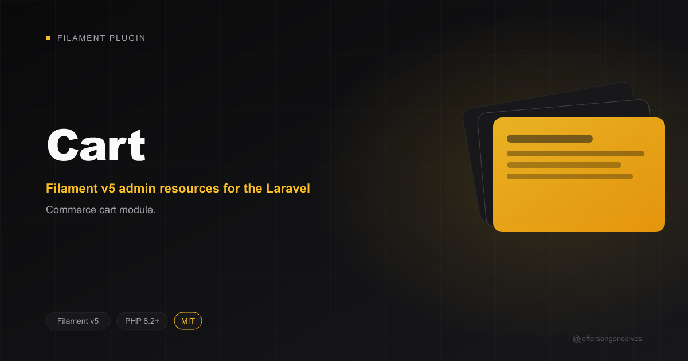

<p align="center"></p>

# Cart

[](https://packagist.org/packages/jeffersongoncalves/filament-commerce-cart) [](https://packagist.org/packages/jeffersongoncalves/filament-commerce-cart) [](LICENSE.md)

Filament v5 admin resources for the Laravel Commerce cart module.

## Installation

```bash
composer require jeffersongoncalves/filament-commerce-cart
```

## Usage

The plugin is auto-discovered. Register it on a Filament panel:

```php
use JeffersonGoncalves\\FilamentCommerce\\Umbrella\\CommercePanelPlugin;

public function panel(Panel $panel): Panel
{
    return $panel->plugin(CommercePanelPlugin::make());
}
```

## License

The MIT License (MIT). Please see [License File](LICENSE.md) for more information.
